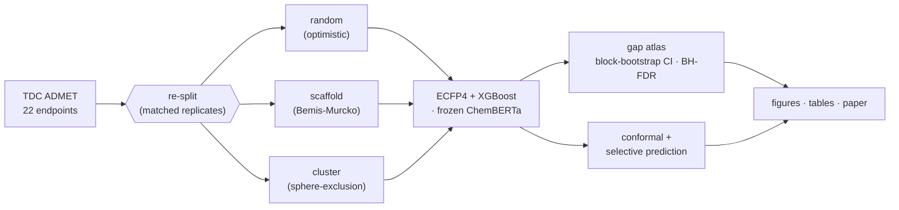
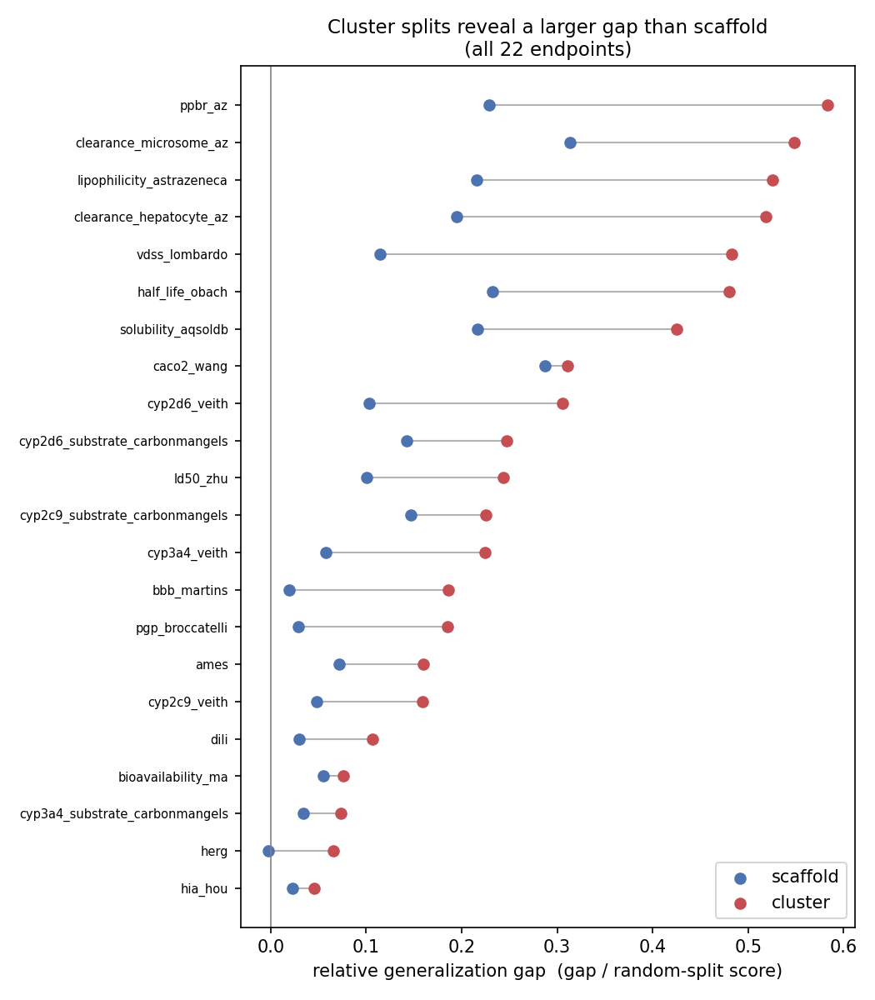
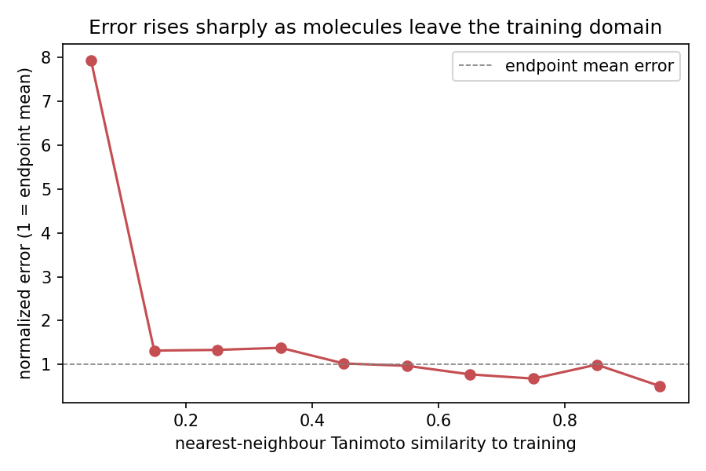
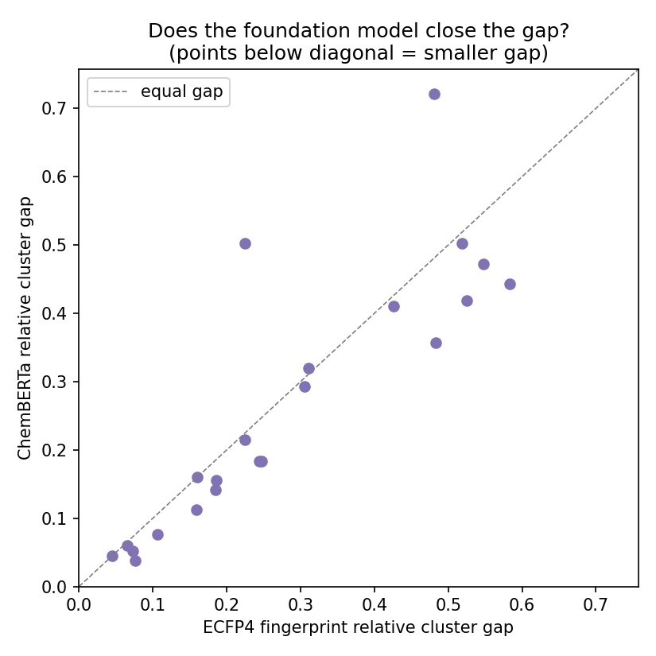

# Honest ADMET

**When does the generalization gap in molecular property prediction appear, why — and
can selective prediction recover it?**

[](LICENSE)
[](pyproject.toml)
[](https://tdcommons.ai/)

*Suleman Imdad — M.S. in Artificial Intelligence, Johns Hopkins University (2026).*

A reproducible re-evaluation of ADMET property prediction on
[Therapeutics Data Commons (TDC)](https://tdcommons.ai/). This is a *reliability and
evaluation layer built on top of TDC*, not a rival benchmark. We are explicit that
neither headline phenomenon is a new discovery — the contribution is rigorous
**consolidation + extension** that no single prior paper provides:

1. **A statistically honest gap atlas.** For all 22 TDC ADMET endpoints and two molecular
   representations (ECFP4 fingerprints and a frozen ChemBERTa embedding), the *signed,
   per-endpoint relative* optimism gap from an optimistic random split to realistic splits —
   with split-seed block-bootstrap CIs, paired tests, and Benjamini–Hochberg FDR. We engage the
   contrarian result that Bemis–Murcko scaffold splits are barely harder than random
   for ADMET (Fooladi et al. 2025) head-on, and therefore treat **cluster/distance
   splits as the primary stressor** and scaffold as the "community default that
   under-stresses."
2. **An honest evaluation of selective prediction under shift — negatives included.** Conformal
   prediction and deep-ensemble abstention measured *under the same scaffold/cluster shift*. We
   tested the appealing hypothesis that abstention cleanly *recovers* the gap and found it largely
   does **not**: split-conformal itself under-covers on high-shift endpoints, covariate-shift
   weighting is a verified no-op, the best abstention signal is model-dependent, and abstention
   benefit does **not** track the optimism gap (ρ=0.07, n.s.). We report these negatives plainly.

## Why this framing

The community standard (TDC) optimizes a single number under one split. A careful,
fully-reproducible study that (a) quantifies *when and why* the gap appears and reverses,
(b) ties it to nearest-neighbour chemical-similarity leakage, and (c) shows uncertainty
as the lever that makes it actionable — is the kind of evaluation rigor the field is
actively asking for (cf. the 2026 "Critical Assessment of ML models for ADMET in TDC
leaderboards"). It also extends the Zitnik lab's own line on trustworthy ML under
distribution shift (TDC → SPECTRA → TxGNN, which explicitly defers uncertainty
quantification to future work).

## Pipeline



## Results (summary)

Five findings across all 22 TDC ADMET endpoints (ECFP4+XGBoost; relative gaps with split-seed
block-bootstrap CIs, paired Wilcoxon, BH-FDR):

<p align="center">
  <br>
  <em>Cluster (sphere-exclusion) splits reveal a larger relative gap than scaffold on all 22 endpoints —
  including hERG, which is flat under scaffold but clearly positive under cluster.</em>
</p>

1. **Gap atlas.** Cluster (sphere-exclusion) splits reveal a gap established on **21/22 endpoints**
   (median relative gap **+0.23**, aggregate *p*<10⁻⁴); scaffold splits are ~2.3× weaker (median
   **+0.10**, not established on 5/22 incl. hERG). Scaffold *under-states* what cluster *reveals*.
2. **Mechanism.** Error spikes ~8× in the most-dissimilar nearest-neighbour bin — an applicability-
   domain effect.
3. **Conformal under shift.** Coverage is near-nominal on average (0.896 vs 0.90) but degrades on
   specific endpoints (BBB 0.84); covariate-shift weighting is a verified no-op that does not restore it.
4. **Abstention (honest negatives).** Best abstention signal is model-dependent (ensemble beats AD
   18/22 under XGBoost; the RF pilot disagreed); abstention benefit does **not** track the gap
   (ρ=0.07, n.s., under-powered).
5. **Foundation model.** Frozen ChemBERTa shrinks the gap modestly but significantly (17/22, *p*=0.011)
   without closing it.

<p align="center">
  
  &nbsp;&nbsp;
  
  <br>
  <em>Left: error rises sharply as molecules leave the training domain (the mechanism behind the gap).
  Right: ChemBERTa shrinks the gap on most endpoints (points below the diagonal) but does not close it.</em>
</p>

Plus official-leaderboard anchoring and a unit-tested conformal core. Manuscript:
[`paper/honest_admet.tex`](paper/honest_admet.tex) (compiles with `tectonic`/Overleaf).

**Reproduce everything:** `bash run_all.sh` (after the install below).

## Methods notes (reproducibility)

- **Two loading modes.** `load_admet` pools TDC's official train_val+test and re-splits
  under controlled regimes (for the split-type comparison; *not* leaderboard-comparable);
  `load_admet_official` returns TDC's native split for leaderboard reproduction.
- **Splits.** `random` (optimistic baseline), `scaffold` (Bemis–Murcko; acyclic molecules
  are singleton groups, not lumped), `cluster` (scalable sphere-exclusion / LeaderPicker —
  the primary OOD stressor, memory-safe on the ~13k-molecule CYP sets).
- **Leakage** is reported with a *splitter-independent* nearest-neighbour ECFP4 Tanimoto
  metric so all three split types are scored on the same footing.
- **Every gap** is a paired, matched-replicate quantity with a bootstrap CI, Wilcoxon
  p-value, and BH-FDR q-value; gaps whose CI crosses 0 are reported as "not established."
- Canonical-SMILES de-duplication; pinned dependency versions; dropped/duplicate counts
  logged per dataset.

## Quickstart

```bash
uv venv --python 3.11 .venv && source .venv/bin/activate
uv pip install -e .          # core
uv pip install -e ".[deep]"  # + torch/transformers for the ChemBERTa foundation-model arm

python experiments/00_smoke_test.py          # env + live TDC access
python experiments/01_validate_splits.py      # leakage + split diagnostics
python experiments/03_leaderboard_repro.py    # reproduce official TDC numbers
python experiments/02_baselines.py            # the gap atlas (CIs, q-values)
```

## Repository layout

```
src/honest_admet/
  data.py        # TDC loading (pooled + official), random/scaffold/cluster splits, leakage
  features.py    # ECFP4 fingerprints (shared MorganGenerator)
  eval.py        # MAE/Spearman/AUROC/AUPRC, ECE (predicted-class), Brier, signed gap
  stats.py       # matched-replicate gap CIs, paired Wilcoxon, BH-FDR, aggregate test
  models/        # baselines (XGBoost/RF) and frozen foundation-model embeddings (ChemBERTa)
experiments/     # 00 smoke · 01 splits · 02 gap atlas · 03 leaderboard repro
results/         # summary tables + figures (small, committed)
paper/           # manuscript draft
```

## Key references we build on / engage

TDC (Huang et al. 2021/2022); Sheridan 2013 (time-split); MoleculeNet (Wu et al. 2018);
Fooladi et al. 2025 (scaffold≈random for ADMET — engaged directly); Guo & Ballester 2024
(scaffold splits overestimate); Li et al. 2024 (conformal GNN for ADMET); CoDrug
(Laghuvarapu et al. 2023, conformal under covariate shift); SPECTRA & TxGNN (Zitnik lab).

## License

MIT
